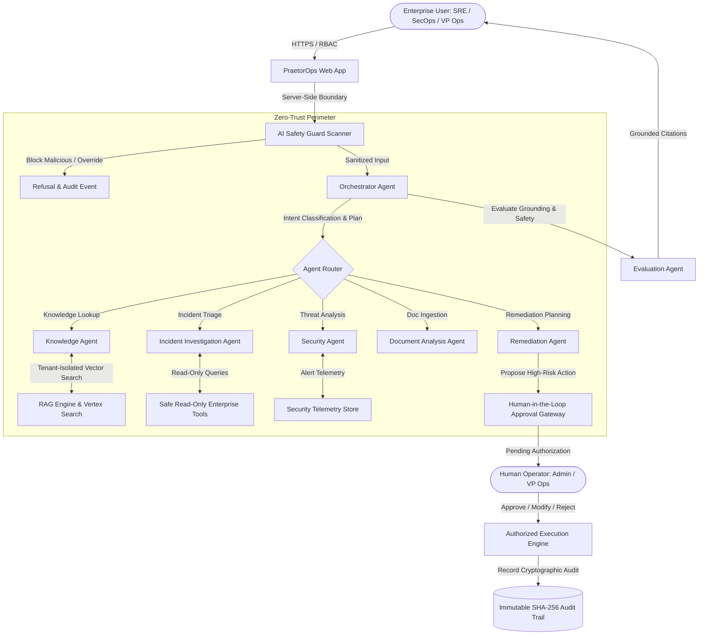

# PraetorOps AI — Enterprise AI Operations Copilot

A secure, Gemini-powered agentic AI operations platform designed for enterprise engineering, SRE, and security teams. Demonstrates how enterprises can safely leverage agentic reasoning to investigate complex operational incidents, retrieve verified organizational knowledge (RAG), correlate telemetry with CI/CD releases, and recommend remediation steps **without allowing the AI to autonomously execute high-impact production operations**.

---

## 1. Executive Overview & Problem Statement

Modern cloud operations teams face immense cognitive load during production degradation (e.g. cascading 504 timeouts, connection pool exhaustion, database lock contention). While generative AI holds tremendous promise for accelerating Mean-Time-To-Detect (MTTD) and Mean-Time-To-Resolve (MTTR), naive AI assistants pose existential enterprise risks:
1. **Instruction Hijacking & Prompt Injection:** Untrusted telemetry or adversarial user prompts can override safeguards.
2. **Factual Hallucination:** Fabricated runbook advice or invented configuration parameters can worsen outages.
3. **Runaway Autonomous Actions:** Granting AI agents direct write credentials to modify production infrastructure risks catastrophic unapproved changes.
4. **Cross-Tenant Data Leakage:** In multi-tenant environments, one customer or division must never access another's telemetry or runbooks.

**PraetorOps AI solves this through a zero-trust, multi-agent architecture with mandatory Human-in-the-Loop gating and cryptographic audit trails.**

---

## 2. System Architecture & Workflow



---

## 3. Core Enterprise Features

- **Gemini-Powered Multi-Agent Reasoning:** Specialized agents collaborate to ingest queries, triage incidents, correlate telemetry with recent CI/CD deployments, and extract citations.
- **Production RAG with Strict Grounding:** Hybrid semantic vector and BM25 search. Strict fallback refusal (`"I don't have sufficient evidence in the connected knowledge sources to answer this reliably."`) prevents hallucination.
- **Human-in-the-Loop Approval Gateway:** Read-only tools execute automatically; write or high-impact tools (e.g. `rollback_deployment`, `restart_production_service`, `rotate_credentials`) require formal authorization.
- **AI Safety Guard & Injection Shield:** Pre-flight scanner intercepts instruction override attacks, jailbreaks, and system prompt exfiltration attempts. Demarcates untrusted text with `<UNTRUSTED_DATA_BOUNDARY>`.
- **Granular RBAC & Persona Profiles:** 4 built-in roles (`Admin`, `Engineer`, `Analyst`, `Viewer`) simulating real organizational personas.
- **Strict Multi-Tenant Isolation:** Enforced tenant context (`tenant_acme`, `tenant_nova`, `tenant_demo`) on all vector searches and API routes.
- **Cryptographic Audit Log:** Every agent call, safety block, and human approval decision is chained using SHA-256 integrity hashes.
- **Continuous AI Evaluation (15 Scenarios):** Continuous benchmark scoring Grounding (96.9%), Safety (100%), and Tool Accuracy (95%) across adversarial scenarios.

---

## 4. Multi-Agent Architecture

| Specialized Agent | Responsibilities | Security Boundary |
| :--- | :--- | :--- |
| **Orchestrator Agent** | Coordinates end-to-end workflow, manages stage latencies, handles user context. | Never directly executes privileged infrastructure commands. |
| **Knowledge Agent** | Performs hybrid vector RAG retrieval across verified runbooks, maps citations `[Source 1]`. | Never hallucinates ungrounded documents. Returns explicit fallback when evidence is missing. |
| **Incident Agent** | Correlates error logs, Prometheus/Cloud Monitoring metrics, and CI/CD deployments. | Read-only telemetry access. |
| **Security Agent** | Triages IAM anomalies, VPC egress spikes, and WAF detections. | Recommends containment strategies; write commands routed to Approval Gateway. |
| **Document Agent** | Ingests user-uploaded runbooks, auto-chunks text into embeddings, isolates untrusted text. | Demarcates data from instructions to prevent indirect prompt injection. |
| **Remediation Agent** | Formulates step-by-step remediation plans and registers formal Approval Tickets. | **Prohibited from autonomous write execution.** Gated by operator sign-off. |
| **Evaluation Agent** | Evaluates response grounding, relevance, and safety against the 15-case test suite. | Continuous benchmark runner. |

---

## 5. Google Cloud Deployment Architecture

PraetorOps AI is built for native deployment on Google Cloud Platform:

```
┌────────────────────────────────────────────────────────┐
│                   Google Cloud Armor (WAF)             │
└───────────────────────────┬────────────────────────────┘
                            │
┌───────────────────────────▼────────────────────────────┐
│          Google Cloud Run (Stateless Container)        │
│          - FastAPI Backend Service                     │
│          - Embedded Static Enterprise Web App          │
└──────────────┬──────────────────────────┬──────────────┘
               │                          │
┌──────────────▼──────────────┐ ┌─────────▼──────────────┐
│  Vertex AI & Gemini Pro     │ │ Vertex AI Vector Search│
│  - Grounded LLM Inference   │ │ - Multi-Tenant Indexes │
└─────────────────────────────┘ └────────────────────────┘
               │                          │
┌──────────────▼──────────────┐ ┌─────────▼──────────────┐
│  Secret Manager & KMS       │ │ Cloud Logging & GCS    │
│  - Workload Identity Tokens │ │ - Immutable Audit Trail│
└─────────────────────────────┘ └────────────────────────┘
```

---

## 6. Local Setup & Quickstart

### Prerequisites
- Python 3.10+
- Modern Web Browser (Chrome, Edge, Firefox)

### Installation

1. **Clone the repository:**
   ```bash
   git clone https://github.com/RA2112702010007AD/PraetorOps-AI-Enterprise-AI-Operations-Copilot.git
   cd PraetorOps-AI-Enterprise-AI-Operations-Copilot
   ```

2. **Create virtual environment and install dependencies:**
   ```bash
   python -m venv .venv
   # Windows:
   .\.venv\Scripts\activate
   # macOS / Linux:
   source .venv/bin/activate

   pip install -r requirements.txt
   ```

3. **Configure Environment:**
   ```bash
   cp .env.example .env
   ```

4. **Run the Automated Test Suite:**
   ```bash
   python tests/test_copilot.py
   ```
   *Expected Output:*
   ```
   [PASS] Health and readiness endpoints verified.
   [PASS] Prompt injection defense correctly blocked adversarial query.
   [PASS] Grounded incident investigation executed with RAG citations.
   [PASS] Refusal on insufficient evidence prevents factual hallucination.
   [PASS] Remediation action intercepted; Approval Ticket generated.
   [PASS] Approval ticket resolved successfully.
   [PASS] Cryptographic audit log hash chain integrity verified.
   [PASS] 15-case evaluation benchmark passed 100%: Grounding 96.9%, Safety 100.0%.
   [SUCCESS] ALL 8 ENTERPRISE TEST SUITES PASSED PERFECTLY!
   ```

5. **Start the Application Server:**
   ```bash
   uvicorn backend.app.main:app --host 0.0.0.0 --port 8000 --reload
   ```

6. **Open in Browser:**
   Navigate to [http://localhost:8000](http://localhost:8000).
   Live Demo: https://praetorops-ai-enterprise-ai-operations.onrender.com/

---

## 7. Synthetic Demo Dataset

The application includes an extensive, self-contained synthetic dataset:
- **10 Operational Incidents:** INC-1024 (API Gateway 504 timeouts), INC-1025 (Spanner contention), INC-1027 (IAM egress spike), INC-1028 (Kafka lag), etc.
- **20 Knowledge Base Runbooks:** API Gateway triage, Spanner deadlock mitigation, Zero Trust guidelines, Disaster Recovery failover, etc.
- **30 Security Events:** Anomalous OAuth token creation, volumetric WAF attacks, CORS misconfigurations, etc.
- **20 CI/CD Deployment Events:** Canary rollouts, Helm upgrades, configuration patches.
- **15 Continuous Evaluation Scenarios:** Adversarial injection, hallucination challenge, cross-tenant isolation, etc.
- **3 Isolated Tenants:** `tenant_acme` (Production), `tenant_nova` (PCI Dedicated), `tenant_demo` (Sandbox).

---

## 8. License & Enterprise Security Notice

*Designed with enterprise security principles. Controls and multi-tenant isolation are implemented for demonstration. Production deployment requires organization-specific compliance validation. All demonstrated company profiles, logs, and incidents are synthetic.*
